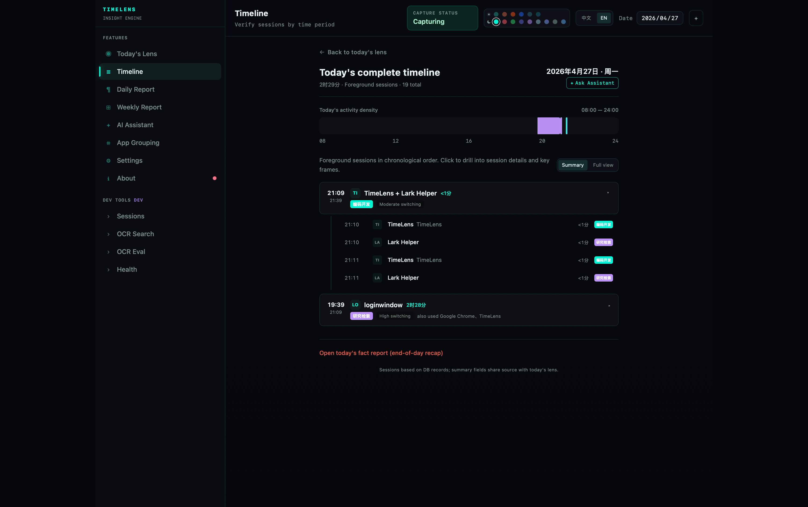
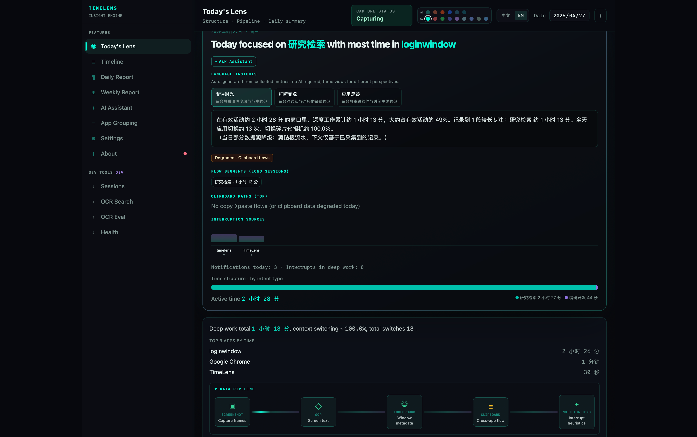
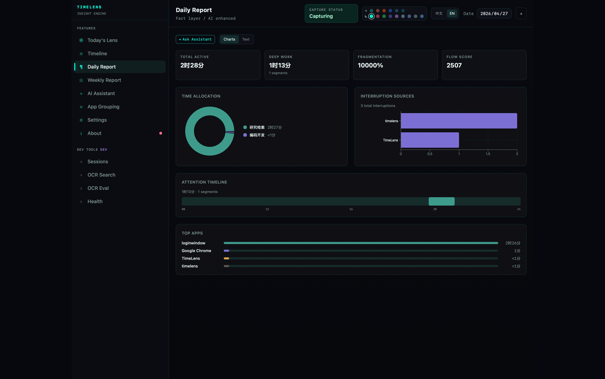
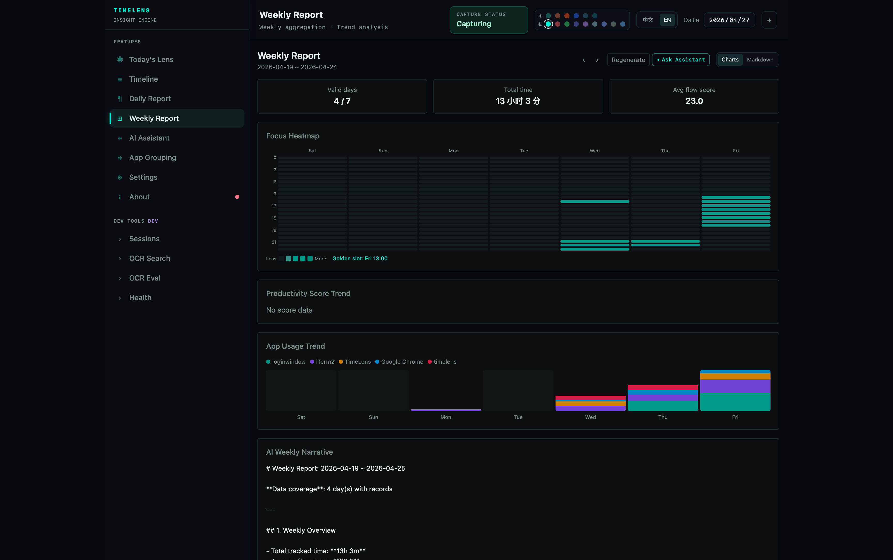
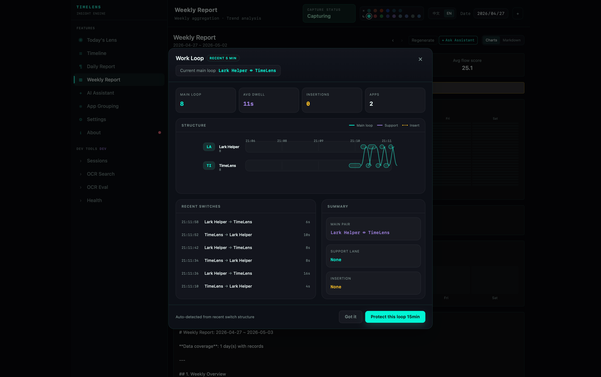
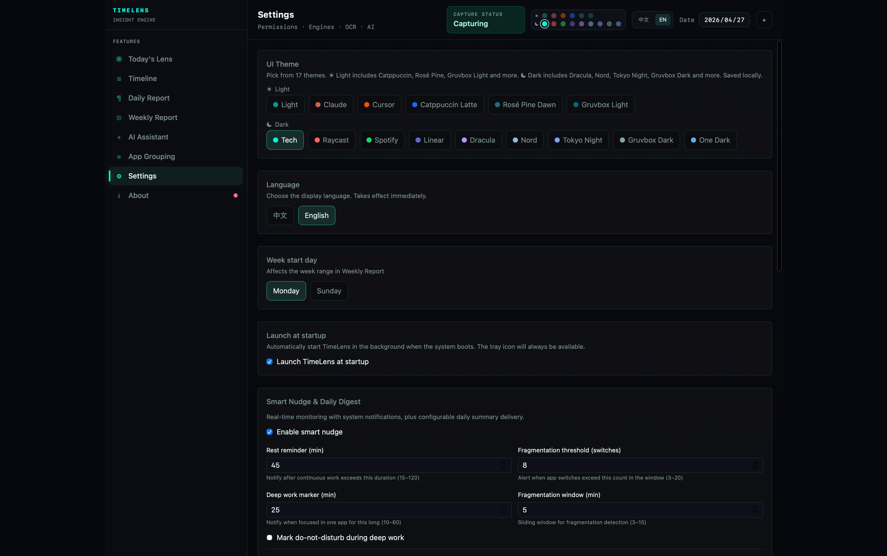

<!-- markdownlint-disable MD033 MD041 MD036 MD060 -->

<div align="center">



# TimeLens

**Local-first AI time engine for macOS and Windows**

Passive tracking, smart screenshots, OCR search, and AI reports. All data stays on your device.

[中文版](README.md)

[](https://github.com/gitxuzhefeng/timelines)
[](LICENSE)
[](https://tauri.app/)
[](https://github.com/gitxuzhefeng/timelines/releases/latest)
[](https://github.com/gitxuzhefeng/timelines/releases/latest)

[Download](https://github.com/gitxuzhefeng/timelines/releases/latest) · [Website](https://timelens-pi.vercel.app/) · [GitHub Actions Builds](https://github.com/gitxuzhefeng/timelines/actions)

</div>

---

## What It Does

TimeLens runs silently in the background, automatically recording how much time you spend in each app and window. Smart screenshots, OCR, and AI analysis turn fragmented desktop activity into reviewable timelines, daily reports, and weekly insights.

No manual check-ins. No account. No cloud upload. Everything stays in a local SQLite database on your device.

---

## Screenshots

<table>
  <tr>
    <td align="center" width="50%">
      <strong>Today Lens</strong><br><br>
      
      <br>
      <sub>Understand your day at a glance</sub>
    </td>
    <td align="center" width="50%">
      <strong>Timeline</strong><br><br>
      
      <br>
      <sub>Review app sessions, windows, and screenshots</sub>
    </td>
  </tr>
  <tr>
    <td align="center" width="50%">
      <strong>Daily Report</strong><br><br>
      
      <br>
      <sub>Turn desktop activity into daily insights</sub>
    </td>
    <td align="center" width="50%">
      <strong>Weekly Report</strong><br><br>
      
      <br>
      <sub>Review your weekly focus rhythm with heatmaps</sub>
    </td>
  </tr>
  <tr>
    <td align="center" width="50%">
      <strong>Work Loop</strong><br><br>
      
      <br>
      <sub>See which apps form your focus loop or interruptions</sub>
    </td>
    <td align="center" width="50%">
      <strong>Settings</strong><br><br>
      
      <br>
      <sub>Configure language, themes, AI, and privacy options</sub>
    </td>
  </tr>
</table>

---

## Live Demo

Below is a **Today Lens** screen recording. Use the GIF for a quick preview, or the MP4 for higher quality with playback controls.

<div align="center">


<video src="docs/assets/timelines宣传/EN/ezgif.com-gif-to-mp4-converter.mp4" controls playsinline width="100%"></video>

</div>

---

## Features

- **Passive capture**: Detects foreground window changes in the background and records app name, window title, and duration without interrupting your workflow.
- **Smart screenshots**: Captures screenshots on window switch, with perceptual-hash deduplication and WebP compression to control disk usage.
- **Session aggregation**: Reconstructs fragmented events into continuous work sessions, filterable by app and date.
- **OCR full-text search**: Runs OCR on screenshots so you can search any past screen content.
- **AI daily and weekly reports**: Turns desktop activity into summaries, metrics, and trend analysis.
- **Work loop visualization**: Identifies main loops, supporting apps, and interruption sources when you switch contexts too often.
- **Local-first**: Stores data in SQLite, requires no cloud service, and does not record keyboard input or clipboard content.
- **Cross-platform and bilingual**: Supports macOS, Windows, Chinese, and English.

---

## Download

| Platform | How to download |
|----------|-----------------|
| macOS | Download the `.dmg` from [Releases](https://github.com/gitxuzhefeng/timelines/releases/latest) |
| Windows installer | Download `*-setup.exe` from [Releases](https://github.com/gitxuzhefeng/timelines/releases/latest) |
| Windows portable | Download `TimeLens.exe` from [Releases](https://github.com/gitxuzhefeng/timelines/releases/latest), extract, and run directly |

> If no release is available yet, download the latest build artifact from the [Actions](https://github.com/gitxuzhefeng/timelines/actions) page.

### macOS First Launch Note

If you see `"TimeLens.app is damaged and can't be opened"` on macOS, this is usually caused by the system quarantine attribute rather than actual file corruption. Run:

```bash
xattr -rd com.apple.quarantine "/Applications/TimeLens.app"
```

---

## Quick Start for Developers

**Prerequisites**: Node.js · Rust toolchain · [Tauri system dependencies](https://v2.tauri.app/start/prerequisites/)

```bash
git clone https://github.com/gitxuzhefeng/timelines.git
cd timelines/project
npm install
npm run tauri dev
```

| Command | Description |
|---------|-------------|
| `npm run tauri dev` | Desktop app development mode |
| `npm run tauri build` | Production build |
| `npm test` | Rust unit tests |

---

## Tech Stack

- **Frontend**: [React 18](https://react.dev/) · TypeScript · [Vite 6](https://vitejs.dev/) · [Tailwind CSS 4](https://tailwindcss.com/) · Zustand · [react-i18next](https://react.i18next.com/)
- **Backend**: [Rust](https://www.rust-lang.org/) · [Tauri 2](https://v2.tauri.app/) · SQLite · Tokio
- **Platform**: macOS acquisition bridge · Windows Win32 acquisition bridge
- **AI**: Bring your own API key, with local-first defaults

---

## Star the Project

If TimeLens helps you understand where your desktop time goes, a GitHub star helps more people discover this local-first productivity tool.

---

## License

[MIT](LICENSE)
