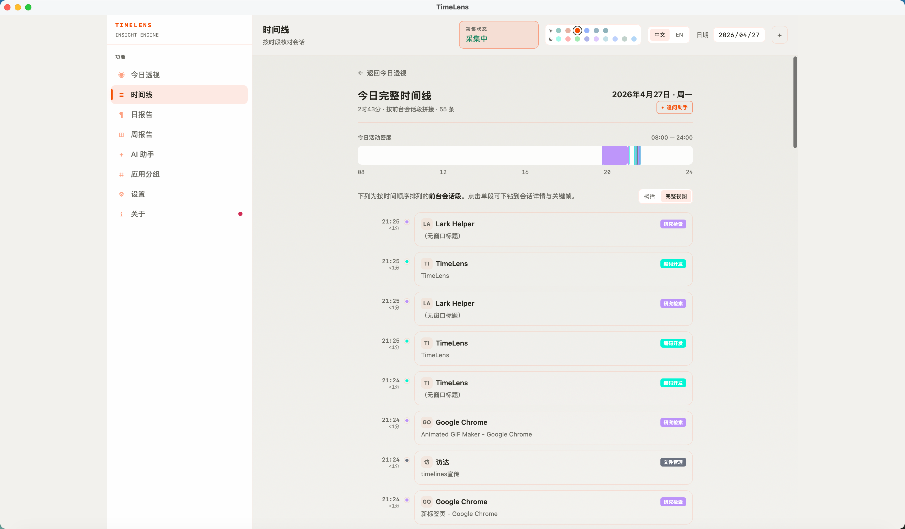
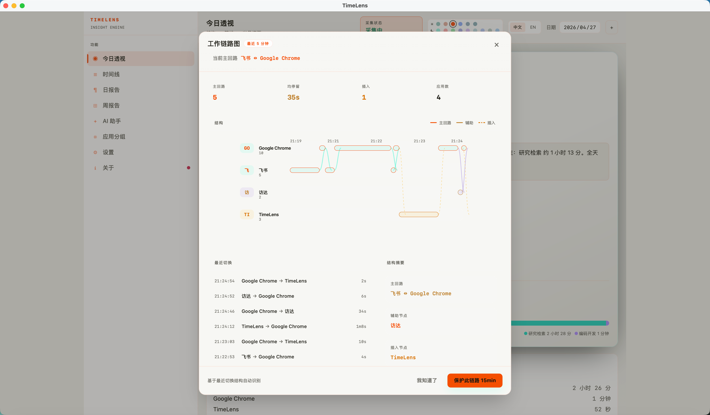
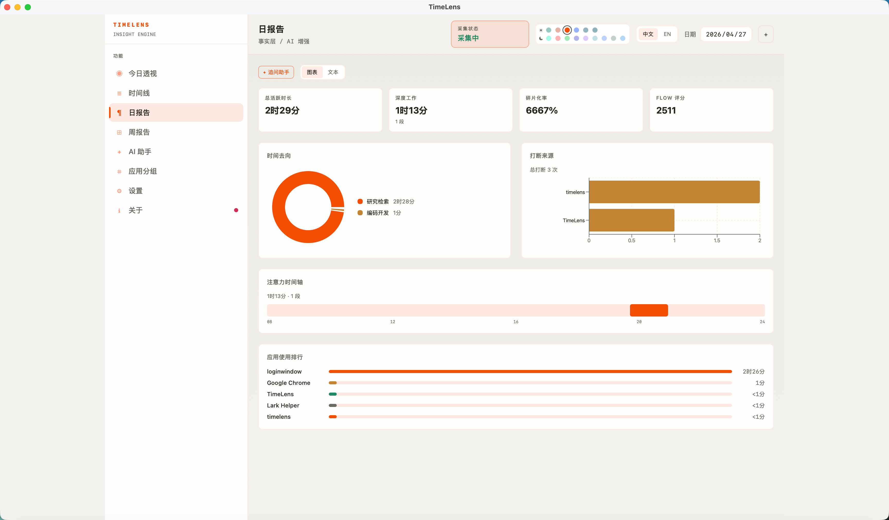
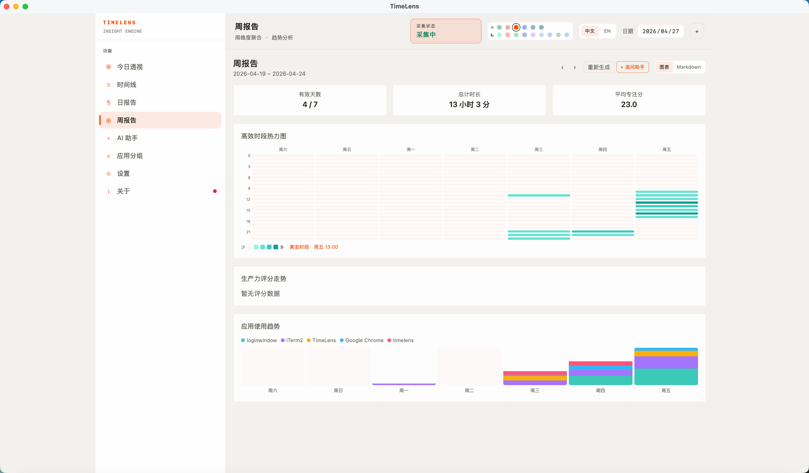
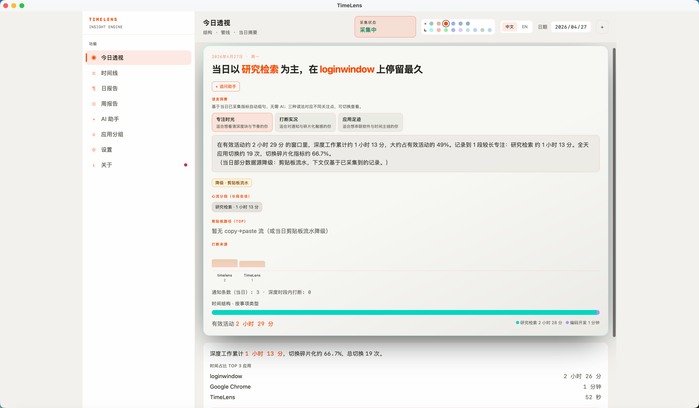
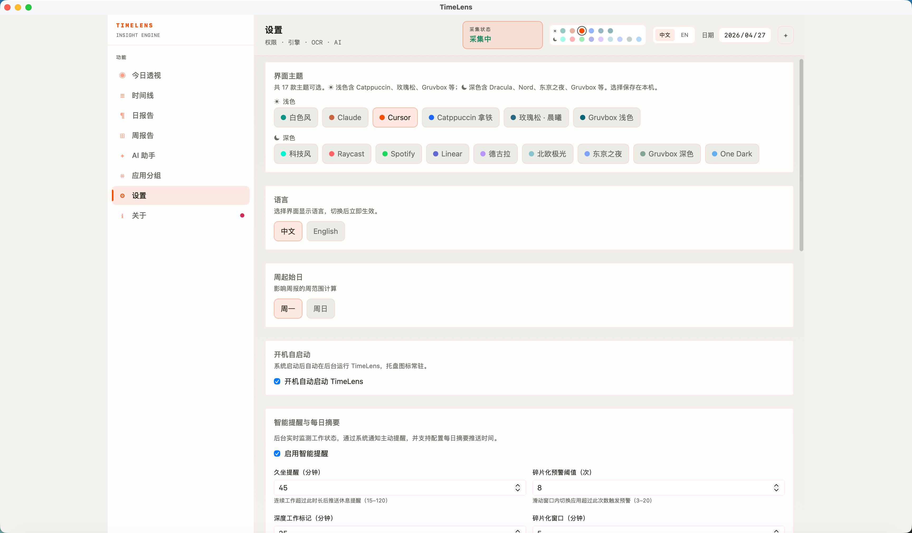
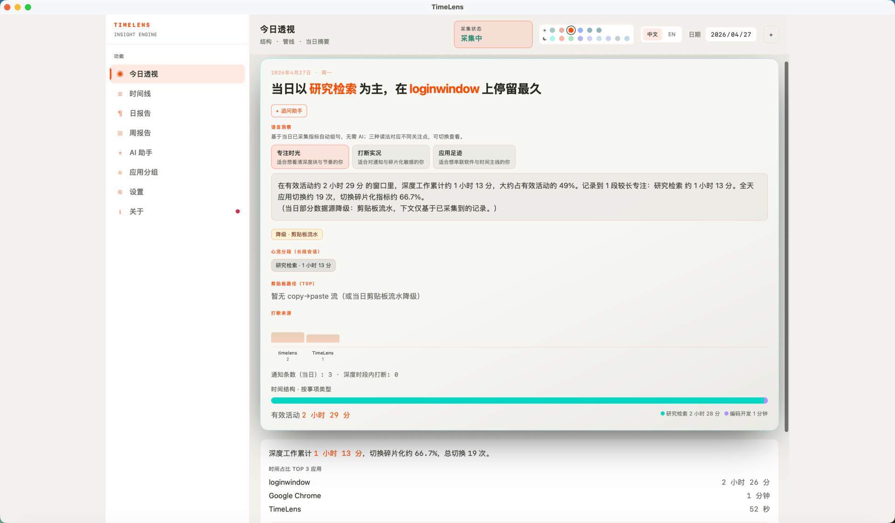

<!-- markdownlint-disable MD033 MD041 MD036 MD060 -->

<div align="center">



# TimeLens · 时间透视镜

**本地优先的 AI 时间感知引擎，支持 macOS 与 Windows**

不用打卡，让电脑自动告诉你时间去了哪里。

[English Version](README.en.md)

[](https://github.com/gitxuzhefeng/timelines)
[](LICENSE)
[](https://tauri.app/)
[](https://github.com/gitxuzhefeng/timelines/releases/latest)
[](https://github.com/gitxuzhefeng/timelines/releases/latest)

[下载](https://github.com/gitxuzhefeng/timelines/releases/latest) · [产品宣传页](https://timelens-pi.vercel.app/) · [GitHub Actions 构建](https://github.com/gitxuzhefeng/timelines/actions)

</div>

---

## 它能做什么

TimeLens 在后台静默运行，自动记录你在每个应用和窗口上花了多少时间，配合智能截图、OCR 和 AI 分析，把碎片化的屏幕行为聚合成可复盘的时间线、日报和周报。

不需要手动打卡，不需要账号，不上传任何数据。一切都存储在本机 SQLite 数据库中。

---

## 界面预览

<table>
  <tr>
    <td align="center" width="50%">
      <strong>今日透视</strong><br><br>
      
      <br>
      <sub>一眼看到今天的时间结构和复盘入口</sub>
    </td>
    <td align="center" width="50%">
      <strong>时间线</strong><br><br>
      
      <br>
      <sub>自动聚合应用、窗口和截图上下文</sub>
    </td>
  </tr>
  <tr>
    <td align="center" width="50%">
      <strong>AI 日报</strong><br><br>
      
      <br>
      <sub>把当天活动自动整理成工作摘要</sub>
    </td>
    <td align="center" width="50%">
      <strong>周报</strong><br><br>
      
      <br>
      <sub>用热力图复盘一周专注节奏</sub>
    </td>
  </tr>
  <tr>
    <td align="center" width="50%">
      <strong>今天看见</strong><br><br>
      
      <br>
      <sub>从屏幕行为中找回关键上下文</sub>
    </td>
    <td align="center" width="50%">
      <strong>设置</strong><br><br>
      
      <br>
      <sub>配置语言、主题、AI 与隐私选项</sub>
    </td>
  </tr>
</table>

---

## 动态演示

下方为 **今日透视** 界面录屏。GIF 便于快速浏览，MP4 画质更清晰，可点击播放控件观看。

<div align="center">



<video src="docs/assets/timelines宣传/CH/ezgif.com-gif-to-mp4-converter_chinese.mp4" controls playsinline width="100%"></video>

</div>

---

## 核心特性

- **被动采集**：后台检测前台窗口变化，自动记录应用名、窗口标题与时长，不打断工作流。
- **智能截图**：窗口切换时抓取画面，感知哈希去重 + WebP 压缩，控制磁盘占用。
- **会话聚合**：把碎片事件还原成连续工作会话，支持按应用、日期筛选与复盘。
- **OCR 全文搜索**：对截图内容做文字识别，可搜索任意历史屏幕内容。
- **AI 日报与周报**：基于当天或一周的会话自动生成工作摘要、指标与趋势分析。
- **工作链路图**：识别频繁切换时的主回路、辅助应用和打断来源。
- **本地优先**：数据存 SQLite，不依赖云端，不记录键盘内容与剪贴板。
- **双平台与双语**：支持 macOS、Windows、中文与英文界面。

---

## 下载

| 平台 | 下载方式 |
|------|----------|
| macOS | 在 [Releases](https://github.com/gitxuzhefeng/timelines/releases/latest) 下载 `.dmg` |
| Windows 安装版 | 在 [Releases](https://github.com/gitxuzhefeng/timelines/releases/latest) 下载 `*-setup.exe` |
| Windows 便携版 | 在 [Releases](https://github.com/gitxuzhefeng/timelines/releases/latest) 下载 `TimeLens.exe`，解压后直接运行 |

> 暂无 Release 时，可在 [Actions](https://github.com/gitxuzhefeng/timelines/actions) 页面下载最新构建产物。

### macOS 首次打开提示

如果 macOS 提示 `"TimeLens.app is damaged and can't be opened"`，通常是系统隔离属性导致，并不代表文件损坏。可以在终端执行：

```bash
xattr -rd com.apple.quarantine "/Applications/TimeLens.app"
```

---

## 快速开始（开发者）

**前置条件**：Node.js · Rust 工具链 · [Tauri 系统依赖](https://v2.tauri.app/start/prerequisites/)

```bash
git clone https://github.com/gitxuzhefeng/timelines.git
cd timelines/project
npm install
npm run tauri dev
```

| 命令 | 说明 |
|------|------|
| `npm run tauri dev` | 桌面应用开发模式 |
| `npm run tauri build` | 生产打包 |
| `npm test` | Rust 单元测试 |

---

## 技术栈

- **前端**：[React 18](https://react.dev/) · TypeScript · [Vite 6](https://vitejs.dev/) · [Tailwind CSS 4](https://tailwindcss.com/) · Zustand · [react-i18next](https://react.i18next.com/)
- **后端**：[Rust](https://www.rust-lang.org/) · [Tauri 2](https://v2.tauri.app/) · SQLite · Tokio
- **平台**：macOS 采集桥接 · Windows Win32 采集桥接
- **AI**：自带 API Key，默认保持本地优先

---

## Star 支持

如果 TimeLens 帮你解决了“时间去哪了”的问题，欢迎给这个仓库一个 star。它会帮助更多正在寻找本地优先效率工具的人发现这个项目。

---

## License

[MIT](LICENSE)
