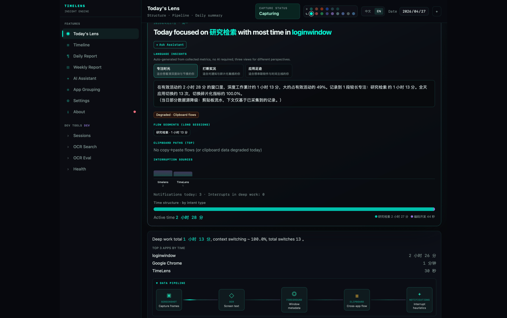

<div align="center">


# TimeLens · 时间透视镜

**被动记录 · 零打卡 · 数据留本机**

让你真正看清每天的时间去了哪里

*Passive tracking · Zero check-ins · All data stays on device*

[产品宣传页](https://timelens-pi.vercel.app/) · [下载 / Download](https://github.com/gitxuzhefeng/timelines/releases/latest) · [GitHub Actions 构建](https://github.com/gitxuzhefeng/timelines/actions)

</div>

---

## 它能做什么 / What it does

TimeLens 在后台静默运行，自动记录你在每个应用和窗口上花了多少时间，配合智能截图还原工作情境，把碎片化的屏幕行为聚合成可复盘的时间线。

不需要手动打卡，不上传任何数据，一切都在本机。

TimeLens runs silently in the background, automatically recording how much time you spend in each app and window. Smart screenshots restore your work context, turning fragmented screen activity into a reviewable timeline.

No manual check-ins. No data uploads. Everything stays on your device.

---

## 界面预览 / Screenshots

<table>
  <tr>
    <td align="center" width="50%">
      
      <sub>今日透视 — 应用时长一览 / Today's Overview — app usage at a glance</sub>
    </td>
    <td align="center" width="50%">
      
      <sub>会话详情 — 情境截图回溯 / Session Details — screenshot context replay</sub>
    </td>
  </tr>
  <tr>
    <td align="center" width="50%">
      
      <sub>AI 日报 — 自动生成工作摘要 / AI Daily Report — auto-generated work summary</sub>
    </td>
    <td align="center" width="50%">
      
      <sub>OCR 全文搜索 — 找回任意历史内容 / OCR Full-text Search — find any past screen content</sub>
    </td>
  </tr>
</table>

---

## 动态演示 / Live demo

下方为 **今日透视（Today’s Lens）** 界面录屏：左侧为中文界面，右侧为英文界面。GIF 便于快速浏览；MP4 画质更清晰，可点击播放控件观看。

Below are screen recordings of **Today’s Lens**: Chinese UI on the left, English on the right. Use the GIFs for a quick preview, or the MP4 files for higher quality (use the player controls).

<table>
  <tr>
    <td align="center" width="50%">
      <strong>中文 / Chinese</strong><br><br>
      
      <br><br>
      <video src="docs/assets/ezgif.com-gif-to-mp4-converter_chinese.mp4" controls playsinline width="100%"></video>
      <br>
      <sub>MP4 高清 / HD video</sub>
    </td>
    <td align="center" width="50%">
      <strong>English</strong><br><br>
      
      <br><br>
      <video src="docs/assets/ezgif.com-gif-to-mp4-converter.mp4" controls playsinline width="100%"></video>
      <br>
      <sub>MP4 HD</sub>
    </td>
  </tr>
</table>

---

## 核心特性 / Features

- **被动采集 / Passive capture** — 后台检测前台窗口变化，自动记录应用名、窗口标题与时长，不打断工作流 / Detects foreground window changes in the background; records app name, window title, and duration without interrupting your workflow
- **智能截图 / Smart screenshots** — 窗口切换时抓取画面，感知哈希去重 + WebP 压缩，控制磁盘占用 / Captures screenshots on window switch; perceptual-hash dedup + WebP compression keeps disk usage low
- **会话聚合 / Session aggregation** — 把碎片事件还原成连续工作会话，支持按应用、日期筛选与复盘 / Reconstructs fragmented events into continuous work sessions; filterable by app and date
- **OCR 全文搜索 / OCR full-text search** — 对截图内容做文字识别，可搜索任意历史屏幕内容 / Runs OCR on screenshots so you can search any past screen content
- **AI 日报 / AI daily report** — 基于当天会话自动生成工作摘要（可选，本地模型或自定义 API）/ Auto-generates a work summary from the day's sessions (optional; local model or custom API)
- **本地优先 / Local-first** — 数据存 SQLite，不依赖云端，不记录键盘内容与剪贴板 / Data stored in SQLite; no cloud dependency; no keylogging or clipboard recording
- **界面双语 / Bilingual UI** — 支持中文与英文界面切换，设置页即时生效 / Switch between Chinese and English in Settings; takes effect immediately

---

## 下载 / Download

| 平台 / Platform | 下载方式 / How to download |
|------|---------|
| macOS | [Releases](https://github.com/gitxuzhefeng/timelines/releases/latest) 下载 `.dmg` |
| Windows 安装版 / Installer | [Releases](https://github.com/gitxuzhefeng/timelines/releases/latest) 下载 `*-setup.exe` |
| Windows 便携版 / Portable | [Releases](https://github.com/gitxuzhefeng/timelines/releases/latest) 下载 `TimeLens.exe`，解压直接运行 / extract and run directly |

> 暂无 Release 时，可在 [Actions](https://github.com/gitxuzhefeng/timelines/actions) 页面下载最新构建产物。
> If no release is available yet, download the latest build artifact from the [Actions](https://github.com/gitxuzhefeng/timelines/actions) page.

---

## 快速开始 / Quick Start (developers)

**前置条件 / Prerequisites**：Node.js · Rust 工具链 / Rust toolchain · [Tauri 系统依赖 / Tauri system deps](https://v2.tauri.app/start/prerequisites/)

```bash
git clone https://github.com/gitxuzhefeng/timelines.git
cd timelines/project
npm install
npm run tauri dev
```

| 命令 / Command | 说明 / Description |
|------|------|
| `npm run tauri dev` | 桌面应用开发模式 / Desktop app dev mode |
| `npm run tauri build` | 生产打包 / Production build |
| `npm test` | Rust 单元测试 / Rust unit tests |

---

## 技术栈 / Tech Stack

[Tauri 2](https://v2.tauri.app/) · [Rust](https://www.rust-lang.org/) · [React 18](https://react.dev/) · [Vite 6](https://vitejs.dev/) · [Tailwind CSS 4](https://tailwindcss.com/) · SQLite · [react-i18next](https://react.i18next.com/)

---

## License

[MIT](LICENSE)
