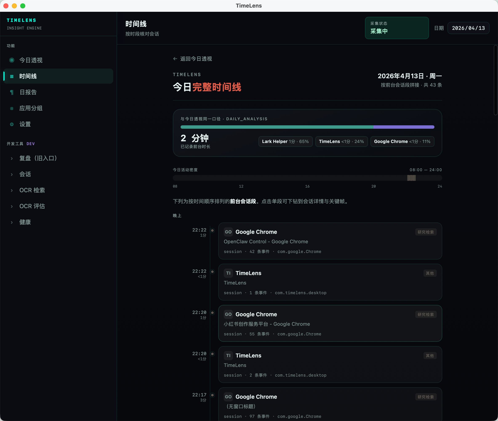
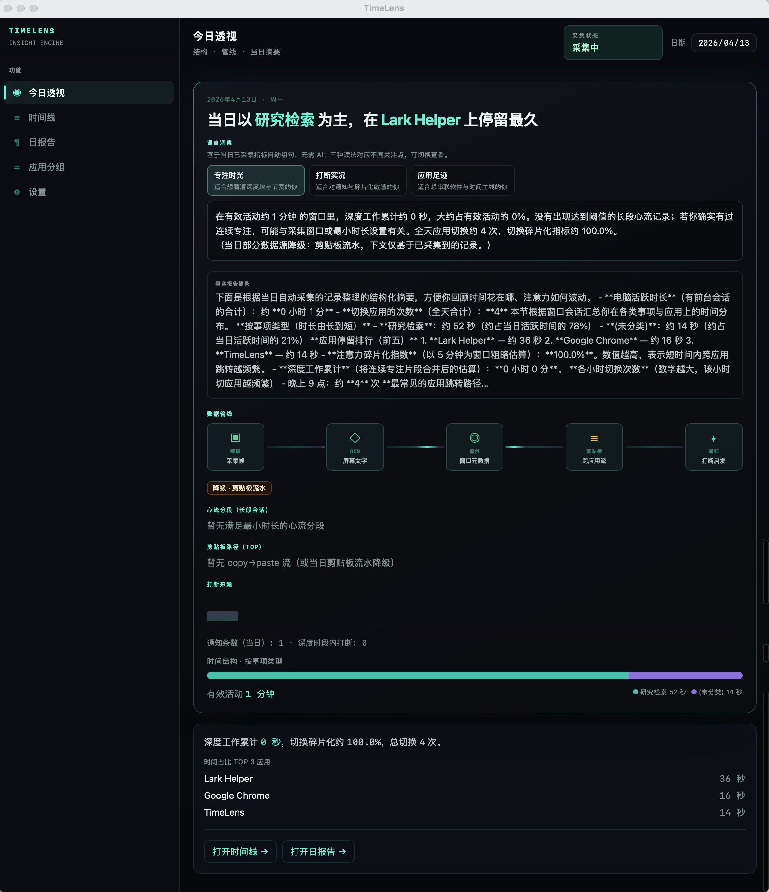
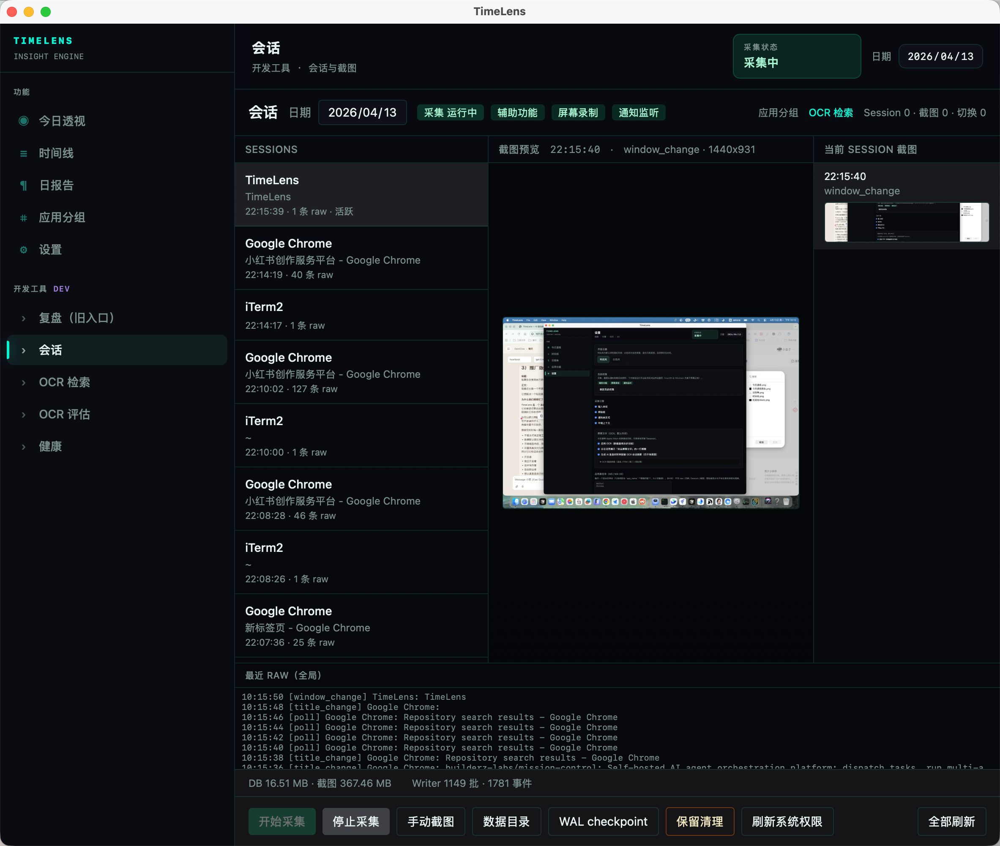
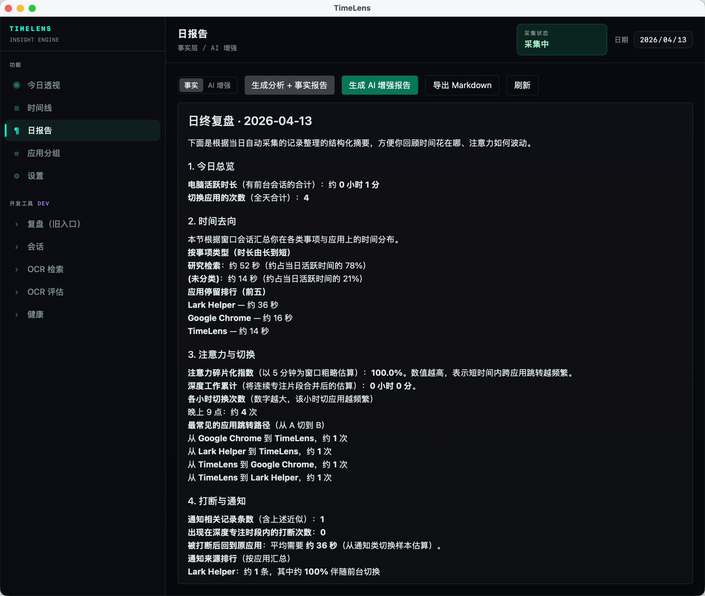
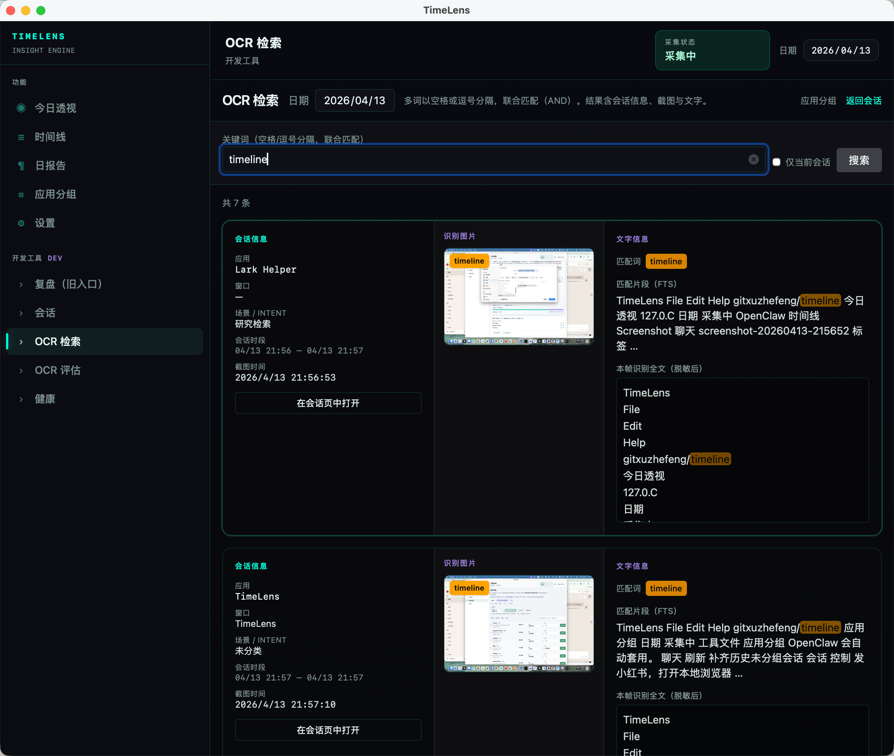

<div align="center">



# TimeLens · 时间透视镜

**被动记录 · 零打卡 · 数据留本机**

让你真正看清每天的时间去了哪里

[产品宣传页](https://timelens-pi.vercel.app/) · [下载](https://github.com/gitxuzhefeng/timelines/releases/latest) · [GitHub Actions 构建](https://github.com/gitxuzhefeng/timelines/actions)

</div>

---

## 它能做什么

TimeLens 在后台静默运行，自动记录你在每个应用和窗口上花了多少时间，配合智能截图还原工作情境，把碎片化的屏幕行为聚合成可复盘的时间线。

不需要手动打卡，不上传任何数据，一切都在本机。

---

## 界面预览

<table>
  <tr>
    <td align="center" width="50%">
      
      <sub>今日透视 — 应用时长一览</sub>
    </td>
    <td align="center" width="50%">
      
      <sub>会话详情 — 情境截图回溯</sub>
    </td>
  </tr>
  <tr>
    <td align="center" width="50%">
      
      <sub>AI 日报 — 自动生成工作摘要</sub>
    </td>
    <td align="center" width="50%">
      
      <sub>OCR 全文搜索 — 找回任意历史内容</sub>
    </td>
  </tr>
</table>

---

## 核心特性

- **被动采集** — 后台检测前台窗口变化，自动记录应用名、窗口标题与时长，不打断工作流
- **智能截图** — 窗口切换时抓取画面，感知哈希去重 + WebP 压缩，控制磁盘占用
- **会话聚合** — 把碎片事件还原成连续工作会话，支持按应用、日期筛选与复盘
- **OCR 全文搜索** — 对截图内容做文字识别，可搜索任意历史屏幕内容
- **AI 日报** — 基于当天会话自动生成工作摘要（可选，本地模型或自定义 API）
- **本地优先** — 数据存 SQLite，不依赖云端，不记录键盘内容与剪贴板

---

## 下载

| 平台 | 下载方式 |
|------|---------|
| macOS | [Releases](https://github.com/gitxuzhefeng/timelines/releases/latest) 下载 `.dmg` |
| Windows 安装版 | [Releases](https://github.com/gitxuzhefeng/timelines/releases/latest) 下载 `*-setup.exe` |
| Windows 便携版 | [Releases](https://github.com/gitxuzhefeng/timelines/releases/latest) 下载 `TimeLens.exe`，解压直接运行 |

> 暂无 Release 时，可在 [Actions](https://github.com/gitxuzhefeng/timelines/actions) 页面下载最新构建产物。

---

## 快速开始（开发者）

**前置条件**：Node.js · Rust 工具链 · [Tauri 系统依赖](https://v2.tauri.app/start/prerequisites/)

```bash
git clone https://github.com/gitxuzhefeng/timelines.git
cd timelines/project
npm install
npm run tauri dev
```

| 命令 | 说明 |
|------|------|
| `npm run tauri dev` | 桌面应用开发模式 |
| `npm run tauri build` | 生产打包 |
| `npm test` | Rust 单元测试 |

---

## 技术栈

[Tauri 2](https://v2.tauri.app/) · [Rust](https://www.rust-lang.org/) · [React 18](https://react.dev/) · [Vite 6](https://vitejs.dev/) · [Tailwind CSS 4](https://tailwindcss.com/) · SQLite

---

## License

[MIT](LICENSE)
