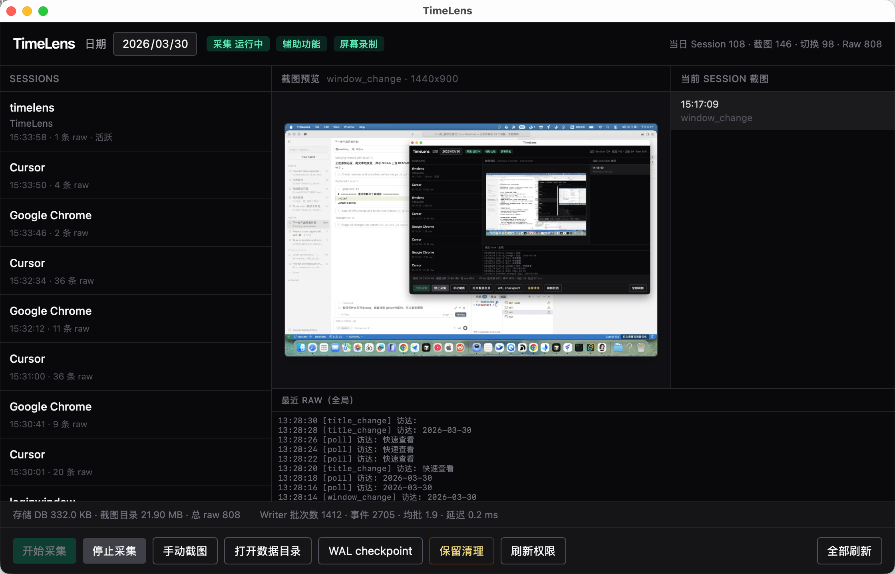

# TimeLens · 时间透视镜

<div align="center">

[](https://github.com/gitxuzhefeng/timelines)
[](https://timelens-pi.vercel.app/)
[](https://github.com/gitxuzhefeng/timelines/releases/latest)

<br />



<sub><strong>真实效果图</strong> · 本地验证看板：左侧会话流、中央截图预览、右侧当前 Session、底部 RAW 日志与 Writer 延迟等指标。产品与路线图的可视化讲解见 <a href="https://timelens-pi.vercel.app/">产品宣传页</a>。</sub>

</div>

---

> **AI 驱动的个人时间透视镜** —— 在 macOS 上自动、被动地记录你的电脑使用行为，用客观数据看清时间真正流向了哪里。（Windows 端采集与打包已合入主干，详见 `docs/windows兼容项目/`。）

每天面对屏幕八小时，却说不清这八小时里究竟发生了什么？TimeLens 用**零手动打卡**的采集方式，把窗口、应用与情境截图连成可追溯的时间线，让主观感受与真实行为对齐。

---

## 宣传页与下载

| 入口 | 说明 |
|------|------|
| [**产品宣传页**](https://timelens-pi.vercel.app/) | 一期数据管道、五大引擎示意、二期 AI 洞察与三期路线图 —— 适合对外介绍与分享。 |
| [**GitHub Releases**](https://github.com/gitxuzhefeng/timelines/releases/latest) | macOS 安装包（DMG）发布后将在此提供；暂无 Release 时可先 [本地构建](#快速开始开发者) 或参考 [DMG 打包指南](docs/DMG打包指南.md)。 |

---

### 给路过朋友的一句话（Star）

如果 TimeLens 恰好戳中你对「时间去向」的好奇，或者你愿意把**本地优先、可审计的数据底座**这类方向推给更多人 —— 欢迎在仓库右上角 **Star ⭐** 一下。这既是对维护者的鼓励，也能帮助其他开发者更快发现本项目。

---

## 为什么选择 TimeLens

| 常见困扰 | TimeLens 的做法 |
|----------|----------------|
| 感觉忙了一天，产出却对不上 | 会话聚合 + 应用/窗口时长，用数据说话 |
| 想复盘「昨天下午三点在干什么」 | 切换即记录，配合智能截图回溯情境 |
| 担心监控类工具碰隐私、上云 | **本地优先**：数据在设备上，不做键盘/剪贴板采集 |
| 传统时间追踪要不停点「开始/结束」 | **被动采集**：后台静默运行，不打断心流 |

---

## 核心能力

- **被动行为追踪** — 周期性检测前台窗口变化，记录应用名、窗口标题与时间戳，自动聚合成工作会话。
- **智能截图** — 窗口切换时抓取画面，结合感知哈希去重、WebP 压缩，控制每日增量体积。
- **会话与时间线** — 从碎片化事件还原「在某应用、某上下文里连续工作了多久」，便于日报与复盘。
- **托盘与状态** — 菜单栏常驻，可查看运行状态、今日统计与存储占用，支持快速暂停/恢复。

更完整的产品说明与示例数据见：[docs/TimeLens_功能介绍.md](docs/TimeLens_功能介绍.md)。

---

## 隐私与安全（本地优先）

- 数据默认**保存在本机**，不依赖云端同步即可使用核心能力。
- **不记录**按键内容、剪贴板与密码；采集边界以窗口元数据与可选截图为限。
- 适合对数据主权敏感的知识工作者与个人用户。

---

## 适用人群

- **开发者 / 技术写作者**：对齐编码、调试、文档与沟通的真实耗时。
- **自由职业与按项目计费**：为工时说明提供客观依据（结合截图情境）。
- **效率与复盘爱好者**：发现上下文切换成本与「时间黑洞」，优化工作节奏。

---

## 技术栈

- **桌面端**：Tauri 2 · Rust（`project/src-tauri`）
- **界面**：React 18 · Vite 6 · Tailwind CSS 4

---

## 快速开始（开发者）

**前置条件**：Node.js、Rust 工具链、macOS 下 Tauri 所需系统依赖（参见 [Tauri 官方文档](https://v2.tauri.app/start/prerequisites/)）。

```bash
# 仓库根目录：安装依赖并启动开发模式
cd project && npm install && cd ..
npm run tauri dev
```

常用脚本（在仓库根目录执行）：

| 命令 | 说明 |
|------|------|
| `npm run dev` | 仅前端 Vite 开发服务器 |
| `npm run tauri dev` | Tauri 桌面应用开发模式 |
| `npm run build` | 前端生产构建 |
| `npm test` | 运行 Rust 侧测试 |
| `npm run release` | 发布构建（见 `scripts/release.sh`） |

安装包与分发流程可参考：[docs/DMG打包指南.md](docs/DMG打包指南.md)。

---

## 文档索引

| 文档 | 内容 |
|------|------|
| [TimeLens_功能介绍.md](docs/TimeLens_功能介绍.md) | 功能详解、场景与路线图 |
| [TimeLens_用户使用手册.md](docs/TimeLens_用户使用手册.md) | 上手与日常使用 |
| [M9_验收与测试.md](docs/M9_验收与测试.md) | 验收与测试说明 |
| [TimeLens_产品迭代规范.md](docs/TimeLens_产品迭代规范.md) | 迭代阶段闸门、文档矩阵、接口与测试交付标准 |

---

## 路线图（摘要）

- **一期（当前）**：多维采集、会话模型、基础看板与验证能力。  
- **二期**：多模态 AI 解读、自然语言日报、更强下钻可视化。  
- **三期**：可选云同步与 GitHub / Notion 等工具链联动。

详见功能介绍文档中的路线图章节。对外讲解时可配合 [产品宣传页](https://timelens-pi.vercel.app/) 中的图示与叙事。

---

## 许可证

本项目以 [MIT License](LICENSE) 开源。

---

**TimeLens** — 让时间透明，让工作可见。
