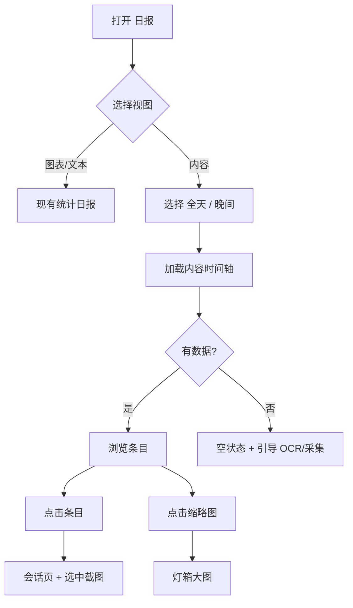

# 内容日报 P0 — 产品设计

## 背景

Issue #10：用户希望在**日报**中按时间看到「做了什么」（截图 + OCR），而非仅 App 用时统计。

## P0 范围（F1–F4）

| ID | 功能 | 说明 |
|----|------|------|
| F1 | 内容时间轴 | 日报新增「内容」视图：时间序列表 |
| F2 | 智能选帧 | 本地规则降噪：黑名单、短会话、phash 去重、每会话上限、时间桶 |
| F3 | 时段切片 | 支持「全天」「晚间（18:00–24:00 本地）」 |
| F4 | 证据跳转 | 点击条目 → 会话页定位截图；缩略图可灯箱 |

**不做**：导出包、AI 叙述、用户自定义过滤规则、无 OCR 时的标题兜底（P0 仅展示有 OCR 的帧）。

## 用户流程

## 页面结构

- 路径：`/report`（不变）
- 顶栏视图切换：**图表 | 文本 | 内容**（第三项为新增）
- 内容视图：
  - 时段：`全天` / `晚间`（Segmented control）
  - 摘要行：`共 N 条代表帧 · 时段内 M 张截图`
  - 垂直时间轴列表（时间 | App | 窗口标题 | OCR 摘要 | 缩略图）

## 选帧规则（用户可感知）

1. 仅 **OCR 成功且未脱敏** 的截图。
2. 排除 **应用黑名单**、**会话 < 20 秒**。
3. 同会话内 **相同 perceptual_hash** 只保留一条。
4. 每会话最多 **2** 条；全局每 **10 分钟** 最多 **1** 条（取 OCR 文字最长者）。
5. 全天最多展示 **64** 条。

## 空状态

| 条件 | 文案方向 |
|------|----------|
| 时段内无截图 | 提示检查采集权限 |
| 有截图无 OCR | 引导开启 OCR 并等待处理 |
| 有 OCR 但全被过滤 | 说明降噪后无代表帧，可改看时间线 |

## 成功指标

- 用户无需离开日报即可扫完「今晚做了什么」。
- 单次加载 < 2s（本地 64 条以内）。
