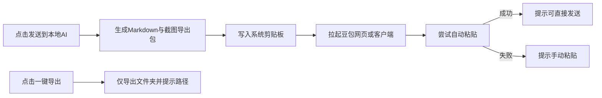

# 时间线幻灯片 + 外部 AI 总结（V2）产品需求

## 1. 目标

在 TimeLens 内实现轻量级「一键发送到本地 AI 工具进行总结」，并与时间线幻灯片页面联动，覆盖以下流程：

1. 打开 AI 工具（默认豆包网页/客户端）。
2. 系统将整理好的 Markdown 通过剪贴板发送到目标输入框（优先尝试自动粘贴，失败回退手动粘贴）。
3. 提供「一键导出」按钮，导出 Markdown 与截图到本地文件夹，便于用户手动上传到 AI。

## 2. 范围确认

- 页面范围：两处同步实现
  - 应用内时间线页：`project/src/pages/TimelinePage.tsx`
  - 原型页：`docs/features/timeline-slideshow-prototype/index.html`
- 默认 AI：仅豆包
  - `doubao_web`：网页 `https://www.doubao.com/chat`
  - `doubao_app`：本地客户端（macOS 先按应用名打开，失败回退网页）
- 发布目标：补丁版本发布（tag + GitHub Release）

## 3. 用户故事

### 3.1 一键发送（主路径）

作为用户，我在时间线幻灯片回看后，点击「发送到本地 AI 工具进行总结」，系统自动准备内容并打开豆包，让我尽量少步骤完成总结。

验收标准：

- 点击后 3 秒内打开目标 AI（或回退网页）。
- 剪贴板中有完整 Prompt + Markdown 正文。
- 自动粘贴成功时，输入框可直接发送；失败时有明确提示「已复制，请手动 Cmd/Ctrl+V」。

### 3.2 一键导出（兜底路径）

作为用户，我可以点击「一键导出」，拿到完整的 MD + screenshots 文件夹，手动上传给 AI。

验收标准：

- 导出目录结构完整：
  - `agent-summary.md`
  - `screenshots/xx.webp`
  - `manifest.json`（可选调试）
- 导出后可直接在 Finder/资源管理器打开目录。

## 4. 关键交互

## 5. 内容来源与规则

- 数据来源：本地 `db.sqlite`（OCR + 会话 + 截图）。
- 选帧规则：复用内容日报 `content_recap` 逻辑（去重、会话过滤、时间桶筛选）。
- Markdown 内容：
  - 固定总结 Prompt
  - 时段信息
  - 逐帧条目（时间、应用、标题、时长、OCR 摘录、截图编号）

## 6. 非功能要求

- 轻量：不引入 Python 启动器，不增加外部运行时。
- 稳定优先：自动粘贴失败不得影响「复制+打开AI」主流程。
- 隐私：仅本地导出；仅在用户主动发送时数据进入外部 AI。
- 国际化：新增 UI 文案必须同步 `zh-CN` 和 `en`。

## 7. 错误与提示文案

- 无可用 OCR：提示「当前日期没有可用 OCR 数据，无法发送总结」。
- 客户端启动失败：提示「豆包客户端未找到，已回退网页」。
- 自动粘贴失败：提示「内容已复制，请在豆包中手动粘贴发送」。
- 导出成功：提示导出路径并提供打开目录能力。

## 8. 版本规划

- V2 MVP（本次）：
  - 时间线页 + 原型页按钮完成
  - 豆包网页/客户端目标完成
  - 自动粘贴尝试 + 回退
  - 一键导出完成
- 后续：
  - 扩展通义/自定义 URL
  - 导出模板可配置
  - 设置页选择默认目标 AI
