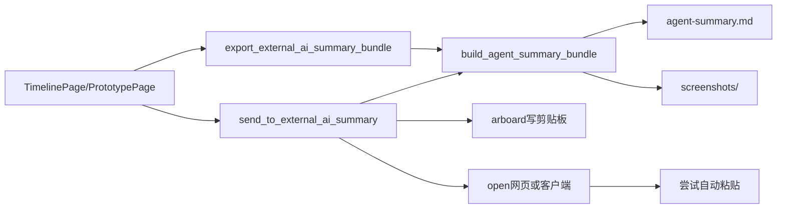

# 时间线幻灯片 + 外部 AI 总结（V2）技术方案

## 1. 总体架构

复用现有 Tauri 能力（`open` + `arboard` + 本地导出），新增最小命令集：

- `send_to_external_ai_summary`
- `export_external_ai_summary_bundle`



## 2. 文件改动规划

### 2.1 后端（Rust）

- `project/src-tauri/src/analysis/agent_export.rs`（新增）
  - 复用 `content_recap` 的筛选思路生成导出包
  - 生成 `agent-summary.md`、`screenshots/`、`manifest.json`
- `project/src-tauri/src/core/external_ai.rs`（新增）
  - Provider 配置（豆包网页/客户端）
  - 剪贴板写入
  - 打开 AI 工具
  - 自动粘贴尝试（平台分支）
- `project/src-tauri/src/analysis/mod.rs`
  - 挂载 `agent_export`
- `project/src-tauri/src/api/commands.rs`
  - 新增 IPC 命令
  - DTO 定义与错误映射
- `project/src-tauri/src/lib.rs`
  - 注册新增命令
- `project/src-tauri/src/core/settings.rs`
  - 新增 settings key：`external_ai_last_provider_id`

### 2.2 前端（React）

- `project/src/services/tauri.ts`
  - 新增 API 封装：
    - `sendToExternalAiSummary(...)`
    - `exportExternalAiSummaryBundle(...)`
- `project/src/types/index.ts`
  - 新增 DTO 类型
- `project/src/pages/TimelinePage.tsx`
  - 增加「发送到本地 AI 工具进行总结」与「一键导出」按钮
  - Provider 选择（豆包网页/客户端）
- `project/src/i18n/locales/zh-CN.json`
- `project/src/i18n/locales/en.json`

### 2.3 原型页（静态）

- `docs/features/timeline-slideshow-prototype/index.html`
  - 增加同名按钮与交互示意
  - 在非 Tauri 环境给出操作提示（不报错）

## 3. IPC 设计

### 3.1 `send_to_external_ai_summary`

入参：

```ts
{
  date: string;                   // YYYY-MM-DD
  slice?: "full_day" | "evening";
  providerId?: "doubao_web" | "doubao_app";
  autoPaste?: boolean;            // 默认 true
}
```

出参：

```ts
{
  exportDir: string;
  markdownPath: string;
  screenshotCount: number;
  providerId: string;
  launched: boolean;
  autoPasteAttempted: boolean;
  autoPasteSucceeded: boolean;
  warning?: string;
}
```

### 3.2 `export_external_ai_summary_bundle`

入参：

```ts
{
  date: string;
  slice?: "full_day" | "evening";
}
```

出参：

```ts
{
  exportDir: string;
  markdownPath: string;
  screenshotCount: number;
}
```

## 4. 自动粘贴策略（轻量 + 可回退）

### 4.1 约束

- 不依赖 DOM 自动化，不识别网页输入框。
- 只在「已成功拉起目标」后尝试系统级快捷键。
- 任意失败都回退为手动粘贴提示。

### 4.2 平台实现建议

- macOS：`osascript` 触发 `Cmd+V`
- Windows：`powershell` + `SendKeys("^v")`（尽力而为）
- 失败不抛硬错误，返回 `warning`

## 5. Provider 策略

默认内置：

- `doubao_web`：总是可用（`open::that(url)`）
- `doubao_app`：
  - macOS：`open -a "豆包"`；失败回退网页
  - Windows：先尝试本地启动（若不可用则回退网页）

## 6. 导出包结构

路径：`~/.timelens/exports/agent/{date}/`

```
agent-summary.md
manifest.json
screenshots/
  01.webp
  02.webp
  ...
```

说明：

- 覆盖同日目录（确保始终是最新）。
- `agent-summary.md` 中包含编号与图片对应关系。
- 文本过长时：
  - 剪贴板内容可截断
  - 文件中的 MD 保留完整版

## 7. 安全与设置联动

- 若 `ocr_enabled=false` 或 `ocr_allow_export_to_ai=false`，发送入口直接阻止并给提示。
- 导出动作不做网络请求，符合本地优先。
- 新增 last provider 持久化通过 `settings::set_setting_str`。

## 8. 回归影响面

- 时间线页新增操作区（UI 变更）
- 新增 IPC 命令（后端接口扩展）
- 不影响现有：
  - `get_content_recap`
  - `export_daily_markdown`
  - `open_url`

## 9. 实施顺序

1. Rust：`agent_export` + `external_ai` + commands 注册
2. TS：service/type 封装
3. TimelinePage 接入按钮流程
4. 原型页补充按钮示意
5. i18n 与提示文案
6. 测试回归与发布
