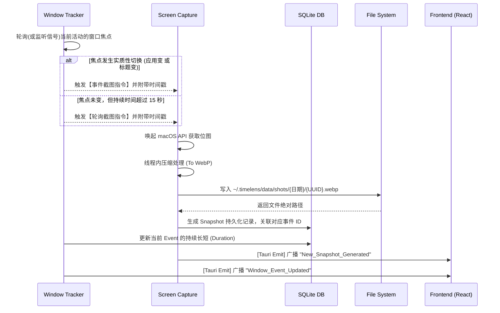

# TimeLens 系统开发技术规范与要求文档

本文档旨在为 TimeLens 一期工程提供全方位的技术开发指导，涵盖从整体架构到具体模块代码层面的实现细节与交互逻辑。

---

## 1. 技术规范与技术路线

### 1.1 技术路线选型
TimeLens 核心目标是做到**“极低系统开销”**、**“跨进程视窗状态获取”**及**“高性能的安全本地沙盒读写”**。为此，项目采用经典的跨平台桌面应用开发路线：**Tauri + Rust + React**。

*   **底层与核心业务环境 (Backend)**：`Rust` + `Tauri 2.0`
    *   **OS 交互**：利用 Rust 调用 macOS 原生 API (Cocoa / CoreGraphics)，实现毫秒级窗口切换监听及无感截屏。
    *   **本地存储**：`rusqlite` (SQLite) 用于高频写入时序关系数据。
    *   **图像处理**：`image` 库用于截图文件的内存级静默压缩（转为 WebP 或 JPEG）。
*   **展现层 (Frontend)**：`React 18` + `Vite` + `TailwindCSS`
    *   主要用于渲染开发者看版（Debug Dashboard）与前端时间轴仪表面板（Timeline）。
    *   采用 `Zustand` 处理全局客户端数据流状态。

### 1.2 技术与编码规范
1.  **绝不联网要求**：在一期设计中，禁止引入任何 `reqwest` 外站网络请求代码，保证 100% 数据留存于本地沙盒（如 `~/.timelens/data/`）。
2.  **异步与线程控制**：Rust 后端中，使用 `tokio` 维护大范围的异步任务。对于图像压缩等 CPU 密集型操作，需使用 `tokio::task::spawn_blocking` 以防止阻塞 Tauri 的主事件循环。
3.  **日志规范**：应用必须全量接入 `env_logger` 和 `log`，并规范区分 `INFO`、`WARN` 和 `ERROR` 级别，便于调试模式输出。
4.  **UI 库规范**：拒绝繁重的组件库（如 AntD），采用 TailwindCSS 和基础 Headless UI 以极致缩减前端体积，保持界面的响应速度。

---

## 2. 前后端系统架构

TimeLens 整体上属于一个 **C/S (Client/Server 变体)** 架构，其中锈(Rust)为 Server 充当本地守护进程，React 为 Client 提供操作视图。

### 2.1 整体分层架构

*   **展示层 (UI Layer)**
    *   **时序视图仪表面板 (Timeline Dashboard)**：包含条件过滤器、事件轴线列表、图片走马灯预览。
*   **通信中间层 (Tauri IPC Layer)**
    *   **Tauri Protocol**：注册自定义静态资源代理协议（如 `timelens://`），绕过 WebView 安全限制，让前端高速读取本地的截图文件。
    *   **Tauri Events**：单向数据流通信，后端抓取到新动作或新图片后，使用 `app_handle.emit` 向前端长连接推流。
    *   **Tauri Commands (Invoke)**：前端向后端拉取历史数据库记录和配置的指令调用。
*   **核心逻辑层 (Core Logic Layer)**
    *   **Tracker Service (行为嗅探)**：5秒一次（或通过 OS hook）检测当前的活跃应用与焦点窗口。
    *   **Capture Service (抽帧引擎)**：接收截屏指令，生成原始像素矩阵。
    *   **Compression Engine (压缩器)**：后台线程组，降低截屏分辨率和质量体积。
*   **数据访问层 (Data Access Layer - DAL)**
    *   **DB 引擎**：向 `SQLite` 中 `INSERT` 时间片记录及快照映射。
    *   **FS 引擎**：负责在文件系统中创建每日独立活页夹（如 `shots/2026-03-18/`）并落盘图片。

---

## 3. 核心功能模块

基于核心架构，系统分解为以下五个独立模块：

1.  **窗口状态监听模块 (Window Tracker Module)**
    负责获取 OS 级别当前的活跃应用名称以及完整窗口标题（文本提取）。
2.  **智能抽帧截图模块 (Screen Capture Module)**
    负责在恰当的时机通过系统 API 获取显示器位图画面，并在内存中完成 WebP 压缩，最后落盘。
3.  **模式控制器模块 (Application Mode Module)**
    处理应用的“系统托盘后台静默模式”与“普通前端窗口模式”的切换与生命周期管理。
4.  **本地时序数据库模块 (Local Database Module)**
    负责管理 SQLite 连接池，记录 `Event (时间切片)` 和 `Snapshot (时间片上的图片关联)`。
5.  **前端全息时序面板模块 (Frontend Timeline UI Module)**
    利用虚拟列表机制渲染海量的图文穿插时序流，保障 60 FPS 的丝滑体验。

---

## 4. 模块间的逻辑交互

### 4.1 核心数据生产流水线 (后端交互)

### 4.2 客户端消费流水线 (前端交互)
1.  **初始化**：React 挂载后，通过 `invoke("get_today_events")` 从数据库拉取当天的事件流数组及关联图片路径。
2.  **视图渲染**：解析路径并拼装 `timelens://localhost/shots/xxxx.webp` 显示为图片预览。
3.  **实时监听**：全局监听 `Window_Event_Updated` 并追加更新到状态机（如 Zustand）的最顶端。

---

## 5. 每个模块的具体实现方式和实现细节

### 5.1 窗口状态监听模块 (Window Tracker)
*   **实现细节**：
    *   在 macOS 环境下，依赖 Cocoa `NSWorkspace` 和 `AXUIElement` 的 Accessibility API 来抓取 `App Name` 和 `Window Title`。
    *   开启一条持续运行的独立线程（`std::thread::spawn`），内部包含一个带有 Sleep（建议 `1s` ~ `2s`）的超级 `while` 循环。
    *   维护局部变量 `last_app` 和 `last_title`，将本次采集和上一次对比。若不同，则结算上一个事件结束时间写入 DB，并初始化下一个事件模型。

### 5.2 智能抽帧截图模块 (Screen Capture)
*   **实现细节**：
    *   推荐使用成熟的 `xcap` crate，避开手动去调用底层 CoreGraphics 的繁琐步骤。
    *   提供两种执行模式的队列：`HighPriority` (窗口切换) 和 `LowPriority` (长时间不动的同窗轮询)。
    *   **内存压缩处理**：获取到的 RGBA 像素矩阵不要直接存 PNG。通过 Rust 的 `image` 系列库，缩放为 1080P 或 720P，降低色彩深度，并转码存为 `WebP` 格式。一张图可以压至数十 KB 内侧，确保硬盘容量健康。

### 5.3 模式控制器模块与主进程调度
*   **实现细节**：
    *   修改 `tauri.conf.json`，将 MainWindow 的 `visible` 默认设置为 `false`。
    *   使用 `@tauri-apps/plugin-tray-icon` 实例化常驻右上角的系统托盘。托盘提供 `Open Dashboard`、`Settings`、`Quit` 等按钮。
    *   当点击 `Open Dashboard` 时，调用 `window.show()` 和 `window.set_focus()` 切出看板。
    *   关闭前台应用窗口时，应拦截系统的 Close 事件 (`window.on_window_event`) 控制为将其“隐藏 (Hide)”而非彻底销毁应用实例。

### 5.4 本地时序数据库模块 (SQLite)
*   **实现细节**：
    *   使用 `rusqlite` 构建连接，由 Tauri 的 `State` 将连接的 `Arc<Mutex<Connection>>` 全局托管。由于 SQLite 原生不支持高并发写入，因此所有 Insert 动作前必须获取安全的线程原子锁。
    *   建表语句拆分成清晰的业务模型：一条 `events` 记录（应用生命周期），多条 `snapshots` 记录（期间截取的组图），二者通过外键强关联。

### 5.5 前端全息时序面板模块
*   **实现细节**：
    *   **自定义 Tauri 静态服务器映射**：在 Tauri Builder 初始化逻辑中，使用 `tauri::Builder::default().register_uri_scheme_protocol("timelens", ...)`，将对特定协议名的请求代理转发给本地物理磁盘路径，解决前端直接展现沙盒图片时的浏览器级 CORS 及安全拦截问题。
    *   **虚拟长列表**：因为一天如果积累几大百条记录以及上千图，普通渲染必定 DOM 卡死。故列表采用 `react-virtuoso` 或 `react-window`，动态只计算并渲染处于视口及近视口范围的树节点。
    *   **预加载交互**：当用户 Hover 在事件节点缩略按钮时，才将对应的 `` 进行实例化展示。避免大规模同时请求磁盘 IO。
